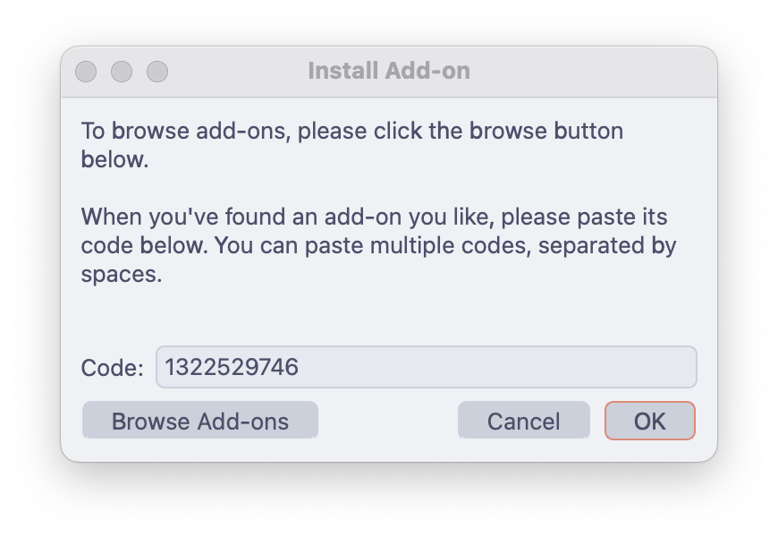
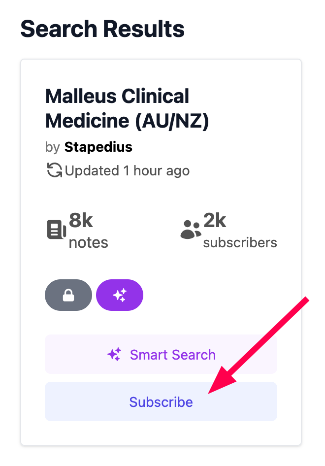
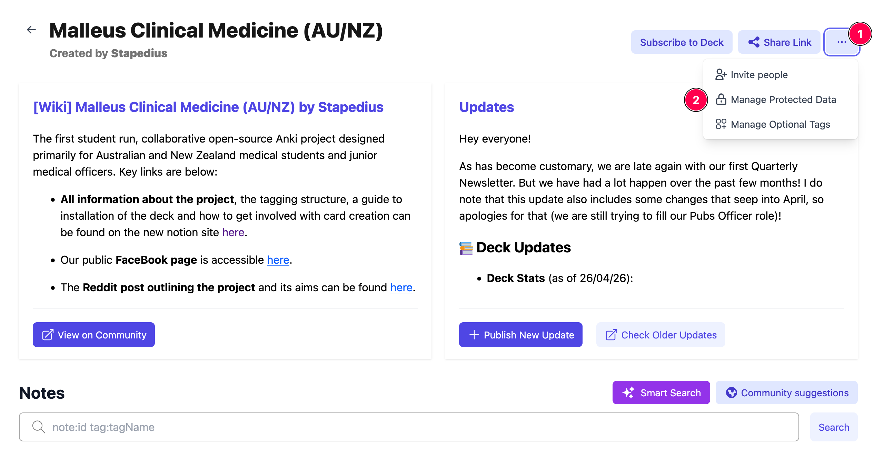
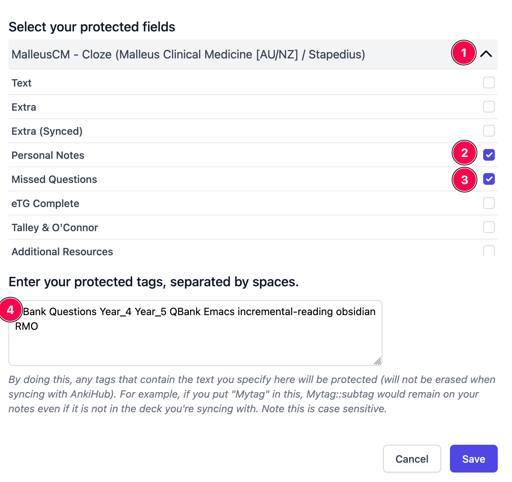

# Get the Deck

The deck is delivered and kept up to date through a collaborative deck platform. Pick a platform below — the steps for each are self-contained.

!!! note "Which platform?"
    **AnkiHub** is the established way to get Malleus today. **AnkiCollab** support is planned — once it's live, this page will carry full instructions for both and you can use either.

=== "AnkiHub"

    ## 1. Create an AnkiHub account

    AnkiHub is **free for everyone** through its scholarship program — the free and paid plans are identical.

    - **Free**: apply for a [scholarship](https://www.ankihub.net/scholarships) at [https://www.ankihub.net/scholarships](https://www.ankihub.net/scholarships) (you just need to watch the video and then scroll to the bottom). You'll usually receive an email within a few days. Nothing after 2 weeks? Contact AnkiHub ([forum](https://community.ankihub.net/) / [email](mailto:support@ankihub.net)).
    - **Paid** ($6 USD/month): [sign up here](https://app.ankihub.net/accounts/signup/) if you'd rather start right away.

    !!! tip
        Save your login details — you'll need them in the next step.

    ## 2. Install the AnkiHub add-on

    1. In Anki, click **Tools → Add-ons → Get Add-ons…**
    2. Paste the code **1322529746** and click OK
    3. Restart Anki
    4. Click **AnkiHub → Sign into AnkiHub** and log in
    
    <video controls muted loop playsinline width="700">
      <source src="../assets/studying-with-the-deck/downloading-ankihub.mp4" type="video/mp4">
    </video>
    
    { width="435" }

    ## 3. Subscribe to the Malleus deck

    Open the [Malleus Clinical Medicine page on AnkiHub](https://app.ankihub.net/decks/5a1160ef-6f41-4d8c-948b-f72275ef0ff7) and click **Subscribe**.

    { width="330" }

    ## 4. Protect your personal notes

    On the same AnkiHub deck page, click **… → Manage Protected Data**, then:

    - tick **Personal Notes** and **Missed Questions**
    - type **leech** (without quotes) into the protected tags field

    This stops deck updates from overwriting things that are yours:

    - **Personal Notes** — your own notes, links to uni lectures, local guidelines
    - **Missed Questions** — screenshots of practice questions you got wrong (e.g. from eMedici or AMBOSS)
    - **leech tag** — Anki automatically tags cards you keep getting wrong so you can review them separately

    { width="700" .frame }

    { width="640" .frame }

    ## 5. Open Anki and install

    Restart or sync Anki. When you see **"You have new AnkiHub decks to install"**, keep the recommended settings and click **Install**.

    !!! success "Welcome aboard! 🎉"
        You've just unlocked the ultimate Anki deck for Aussie and Kiwi med students. Dive in and have fun! 📚🩺

=== "AnkiCollab"

    !!! info "Coming soon"
        AnkiCollab support for the Malleus deck is planned but not yet live. Once the deck is published on [AnkiCollab](https://www.ankicollab.com/), this tab will walk you through:

        1. Installing the AnkiCollab add-on
        2. Subscribing with the Malleus subscription key
        3. Protecting your personal notes and tags

        In the meantime, use the **AnkiHub** tab — everything else in these docs applies regardless of platform.

## Recommended extra add-ons (optional)

??? note "Add-ons that make Malleus better — click to expand"

    - [Malleus Anki Helper](https://ankiweb.net/shared/info/620451841) — code **620451841**. Find cards by topic and create correctly tagged cards from inside Anki. Strongly recommended; it's used throughout this guide. [Full guide here](../addon/index.md).
    - [Mini Format Pack](https://ankiweb.net/shared/info/295889520) — code **295889520**. Extended text editor; needed for some formatting in the [Submission Guidelines](../contributing/guidelines/index.md).
    - [Wrapper meta-addon](https://ankiweb.net/shared/info/396502676) — code **396502676**. Makes citing images easy (see [Images and copyright](../contributing/guidelines/referencing.md#images-and-copyright)).
    - [Spellchecker](https://ankiweb.net/shared/info/143753963) — code **143753963**. Australian medical spellcheck; [setup instructions](../contributing/guidelines/style-guide.md#spelling).

    Restart Anki after installing add-ons.
