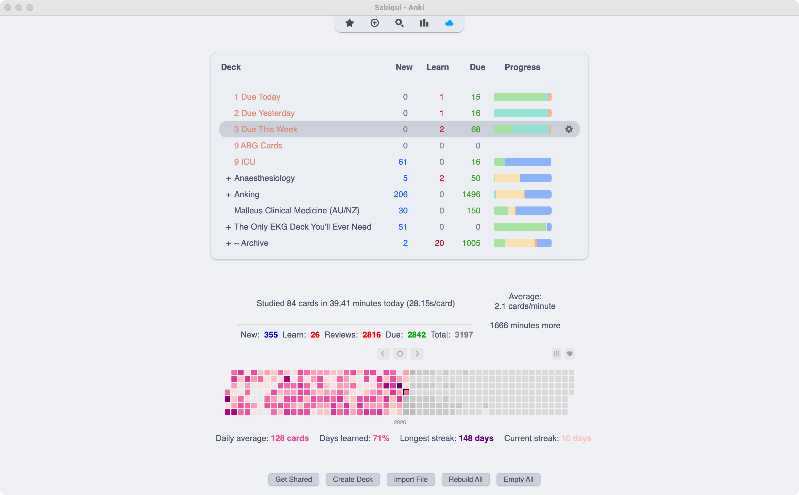

# Install Anki

Anki is the free flashcard program that powers the deck. Download it for your computer from [apps.ankiweb.net](https://apps.ankiweb.net/) and install it.

You can also review on your phone with [AnkiMobile (iOS)](https://apps.apple.com/au/app/ankimobile-flashcards/id373493387) or [AnkiDroid (Android)](https://play.google.com/store/apps/details?id=com.ichi2.anki) — but you still need the computer version to set up and sync the deck.

{ width="700" }

Once Anki is installed, the next step is subscribing to the deck.
