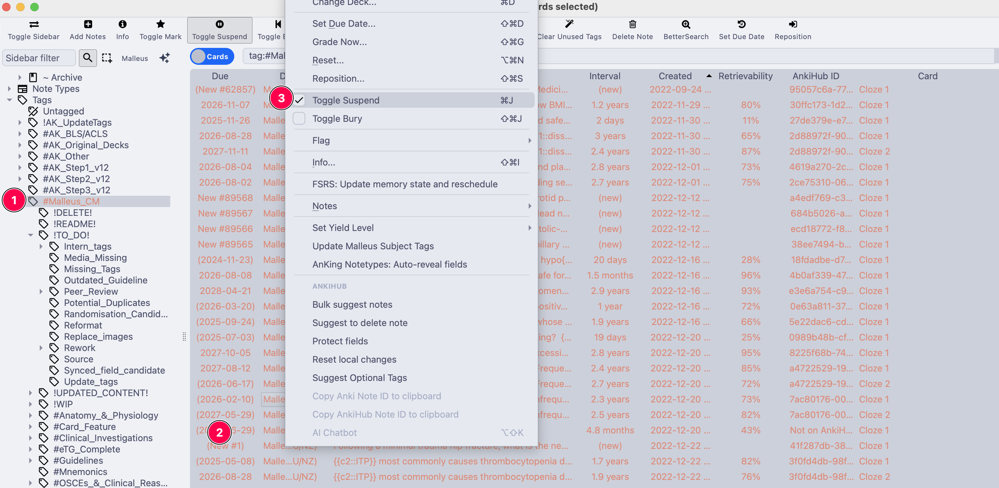
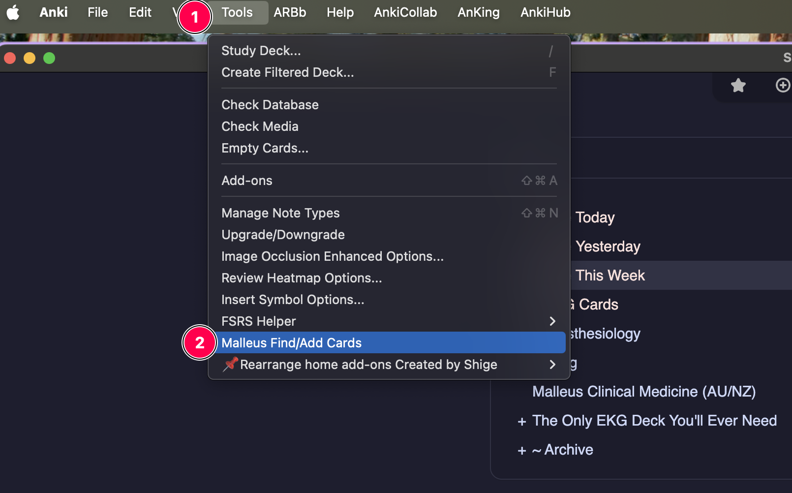
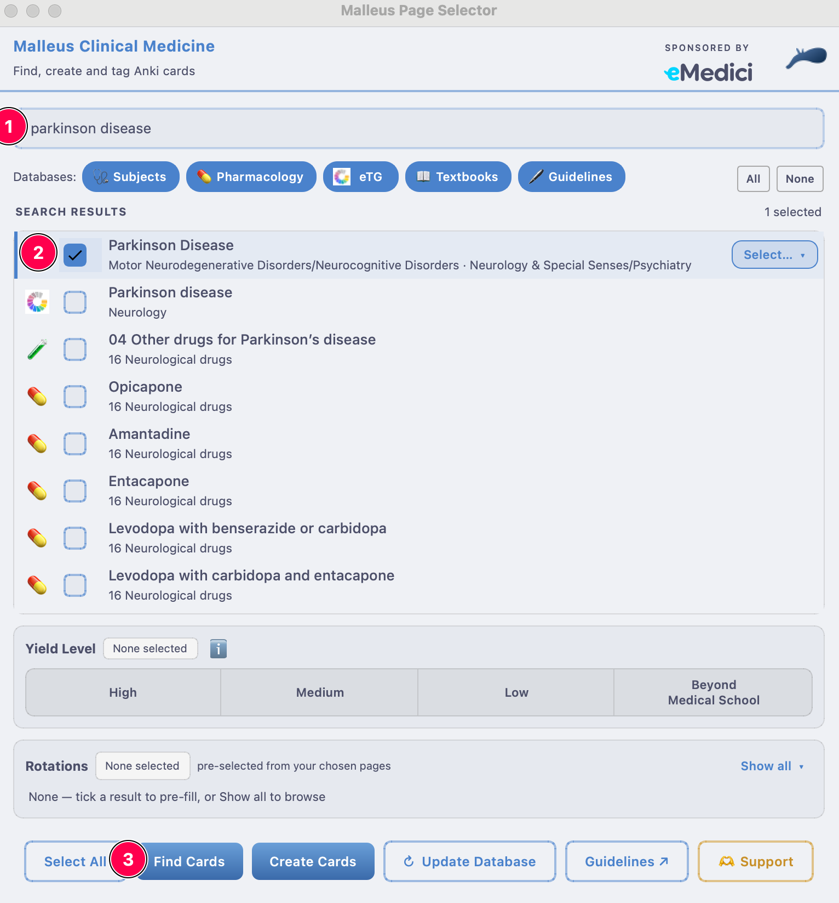
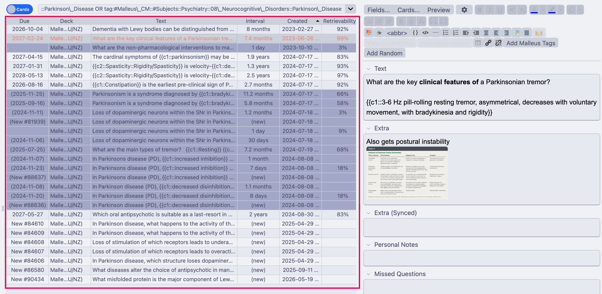
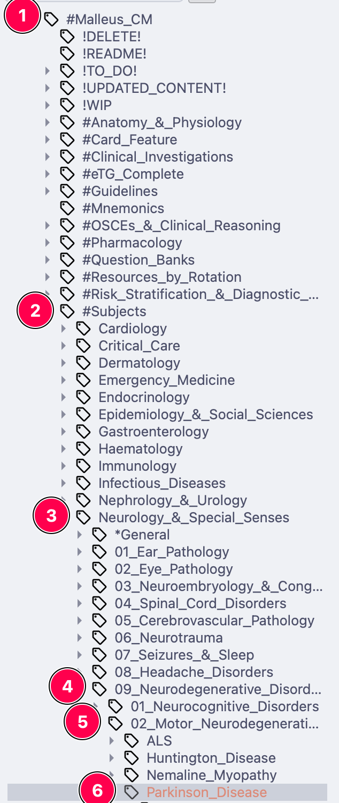

# Studying with the Deck

The deck is organised by **tags**, not sub-decks. Every card is tagged by subject, rotation, yield, and more — so you choose exactly what to study by suspending and unsuspending cards.

## Step 1 — Suspend everything (once)

When you first install, every card is active. Start by suspending them all, then bring back only what you're studying:

1. Click **Browse** (shortcut: ++b++)
2. In the sidebar, find **Tags → #Malleus_CM**
3. Click any card in the main window, then select all (++ctrl+a++ / ++cmd+a++)
4. Right-click → **Toggle Suspend** (++ctrl+j++ / ++cmd+j++)

    { width="700" }

All cards should now be yellow (suspended). You only ever do this once.

## Step 2 — Unsuspend what you're studying

Find the cards for your current topic and unsuspend them the same way (select → ++ctrl+j++ / ++cmd+j++). Three ways to find them:

### Easiest — the Malleus Helper add-on

1. Click **Tools → Malleus Find/Add Cards** (or the Malleus button in the Browser)

    { width="600" }

2. Type a topic (e.g. "Parkinson disease"), select the relevant results, and click **Find cards**. *Optionally add other selectors (e.g. yield or subtag such as management)*

    { width="500" }

3. Unsuspend the cards that you want to study

    { width="700" }

See the [add-on guide](../addon/index.md) for everything else it can do.

### The tag tree

In the Browser sidebar, drill down e.g. **#Malleus_CM → #Subjects → Neurology_&_Ophthalmology → 11_Degenerative_Disorders → Parkinson_Disease**, or **#Malleus_CM → #Resources_by_Rotation → Obstetrics_&_Gynaecology** at the start of a rotation.

    
### Search the Malleus Notion site

Use the search on [the Malleus Notion site](https://malleuscm.notion.site) to find a disease page; it shows the exact tag hierarchy to look for in Anki.

??? note "Doing eMedici questions? Find matching cards in one click"

    Our browser extension finds the Malleus cards for whatever eMedici question you're on:

    1. Install the [Malleus extension from the Chrome Web Store](https://chromewebstore.google.com/detail/malleus-qbank-search/ckihgpchidmfkbnodeeccpogbkcfgpmh)
    2. Install the [AnkiConnect add-on](https://ankiweb.net/shared/info/2055492159)
    3. With Anki running, click the extension in your toolbar — an Anki Browser window opens with all the relevant cards, ready to unsuspend or move to a filtered deck

    It works on much more than eMedici — see the [extension guide](../extension/index.md).

## Step 3 — Review

Back on the Anki main screen, click **Malleus Clinical Medicine (AU/NZ) → Study Now**. That's it — do your reviews daily and let spaced repetition do the rest.

📷 Screenshots to migrate: deck list, Study Now

